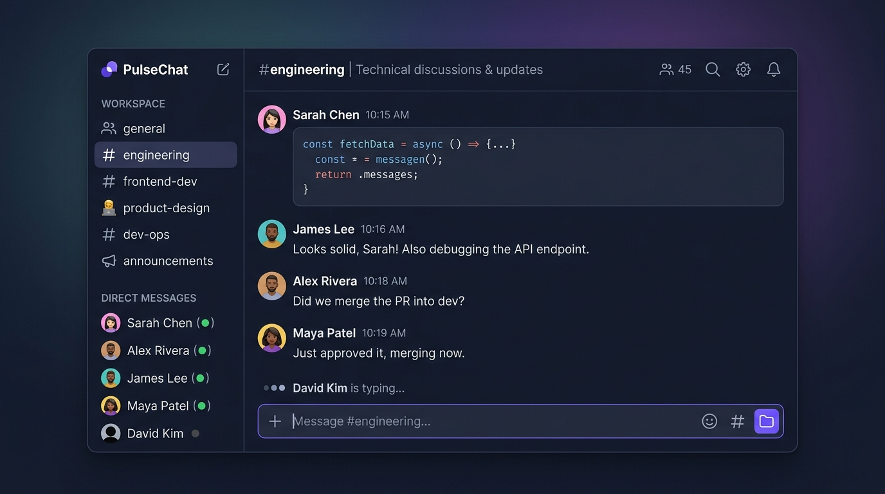
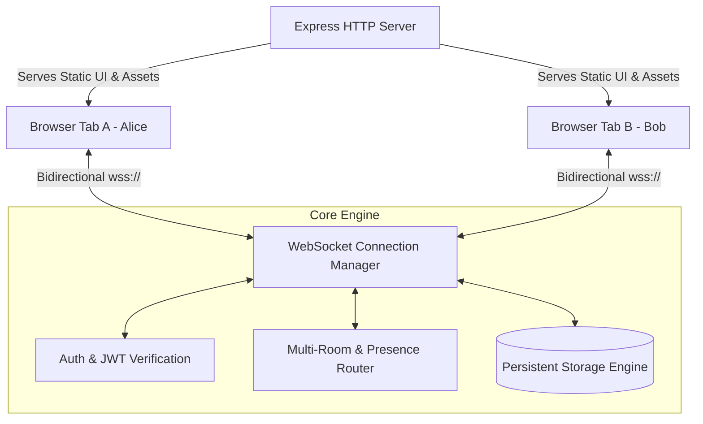

# ⚡ PulseChat — Low-Latency Real-Time Engine

[](LICENSE)
[](https://nodejs.org)
[](https://www.typescriptlang.org/)
[](https://developer.mozilla.org/en-US/docs/Web/API/WebSockets_API)
[]()



A production-grade, full-duplex real-time communication platform engineered from the socket layer up. Built with **TypeScript**, **native WebSockets**, **persistent database storage**, **JWT session verification**, and a responsive client interface.

Created by [**cirutsohtorik**](https://github.com/cirutsohtorik).

---

## 🏛️ System Architecture

PulseChat bypasses third-party managed BaaS (Firebase, Pusher) to give complete control over the networking stack, framing, concurrency, and persistence:



---

## 🚀 Key Features

- **Full-Duplex Real-Time Communication**: Zero polling. Events, messages, and state updates stream with sub-10ms delivery.
- **Dynamic Channels & Rooms**: Support for isolated discussion channels (`#general`, `#engineering`, `#random`, `#showcase`) with seamless instant switching.
- **Live User Presence & Typing Indicators**: Instant peer status updates when users join, switch rooms, disconnect, or are typing.
- **Heartbeat & Reconnection Backoff**: Ping-pong keepalive prevents stale socket leaks; client automatically reconnects with exponential backoff on network drop.
- **Cryptographic Security**: PBKDF2 with unique salts for password hashing, and HMAC-SHA256 tokens for tamper-proof session restoration.
- **Persistent Storage**: Messages and user accounts persist across server restarts via an append-only JSON/WAL database engine.
- **Zero Heavy Front-End Dependencies**: Instant load time with pure reactive DOM client architecture.

---

## 📋 WebSocket Protocol Specification

All communication occurs over JSON-framed payloads conforming to strict message contracts:

| Event Type | Direction | Description |
|---|---|---|
| `AUTH` | Client → Server | Authenticates with username and optional JWT token |
| `AUTH_SUCCESS` | Server → Client | Returns user identity, fresh token, and room list |
| `JOIN_ROOM` | Client → Server | Subscribes client to a channel's broadcast group |
| `ROOM_HISTORY` | Server → Client | Streams historical messages for the active channel |
| `CHAT_MESSAGE` | Bidirectional | Sends/receives user chat messages |
| `TYPING` | Client → Server | Broadcasts typing activity to room peers |
| `USER_JOINED` / `USER_LEFT` | Server → Client | Real-time presence notifications |
| `PING` / `PONG` | Bidirectional | Heartbeat keepalive every 25 seconds |

---

## 🛠️ Getting Started

### Prerequisites
- [Node.js](https://nodejs.org/) (v18 or higher)
- npm or yarn

### 1. Installation
```bash
# Clone the repository
git clone https://github.com/cirutsohtorik/pulsechat-realtime.git
cd pulsechat-realtime

# Install dependencies
npm install
```

### 2. Run Development Server
```bash
# Compile and start server with hot reload
npm run dev

# Or build and run production bundle
npm run build
npm start
```

Open your browser at **`http://localhost:3000`**.

> **Pro-Tip for Testing**: Open `http://localhost:3000` in two separate browser windows (or one regular window and one Incognito window) to test real-time conversations between multiple users!

---

## 🧪 Automated Testing

PulseChat includes a built-in automated test suite covering cryptographic authentication, token verification, tampering resistance, and database persistence:

```bash
# Compile and run test assertions
npm test
```

---

## 📂 Project Structure

```
pulsechat-realtime/
├── src/
│   ├── auth/
│   │   └── authService.ts      # PBKDF2 hashing, JWT signing and verification
│   ├── db/
│   │   └── database.ts         # Persistent data layer (users, rooms, messages)
│   ├── ws/
│   │   ├── protocol.ts         # Strongly-typed WebSocket message contracts
│   │   └── wsManager.ts        # Connection tracker, presence & room broadcasts
│   ├── public/                 # Client front-end application
│   │   ├── css/style.css       # Discord-inspired modern dark theme
│   │   ├── js/socket.js        # Resilient client WebSocket wrapper
│   │   ├── js/app.js           # UI controller and event binding
│   │   └── index.html          # Chat interface layout
│   └── server.ts               # Express HTTP + WebSocket unified entry point
├── tests/
│   └── server.test.ts          # Automated verification test suite
├── package.json
├── tsconfig.json
├── LICENSE
└── README.md
```

---

## 👨‍💻 Author

**cirutsohtorik**  
- GitHub: [@cirutsohtorik](https://github.com/cirutsohtorik)  

---

## 📄 License

This project is licensed under the MIT License — see the [LICENSE](LICENSE) file for details.
